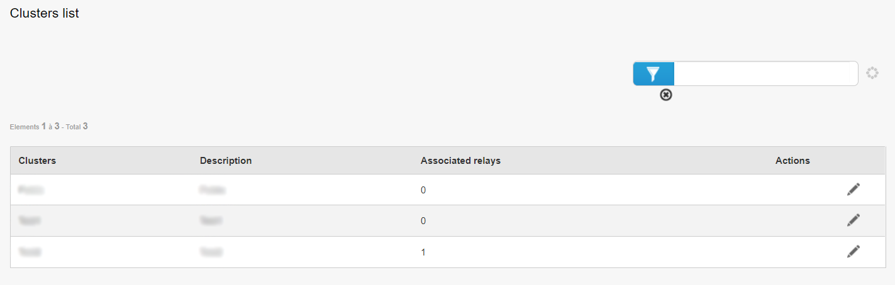
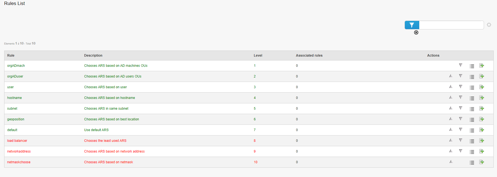

==========
Admin
==========

| Cette section concerne la partie Admin de l'outil Pulse.
| Le menu Admin regroupe les informations sur la liste des relais.
|

.. image:: images/principal.png

|
| Lorsqu'on clique sur le menu Admin, on retrouve directement la liste de nos différents relais.
| La page par défaut est "List of relays", soit la liste des relais.

Liste des relais
=================

| Sur cette page, on peut retrouver toutes les infos des relais : 
| - le nom du relais,
| - son JabberID,
| - le nom du cluster dans lequel est contenu le relais,
| - la description du cluster,
| - le nombre de machines sur le relais,
| - les machines non-inventoriées en ligne présentes sur le relais,
| - sa classe,
| - l'adresse MAC du relais,
| - son adresse IP,
| - les actions possibles à lancer sur le relais.
|
| Concernant le dernier point, les différentes actions sont les suivantes :
|
| **Liste de packages** : Affiche la liste des paquets présents sur le relais,
| **Reconfigurer les machines** : Permet de lancer la Quick Action de reconfiguration des machine sur toutes les machines présentes sur le relais,
| **Switch** : Permet d'éteindre le relais,
| **Editer les fichiers de configuration** : Permet d'éditer les fichiers de configuration du relais,
| **QA lancées** : Affiche la liste des Quick Actions lancées,
| **Actions** : Permet de lancer une action sur le relais (Reboot, Process, Disk Usage...),
| **Bannir** : Banni le relais. Celui-ci sera considéré comme hors-ligne,
| **Débannir** : Débanni le relais. Il pourra à nouveau être utilisé,
| **Prise en main à distance** : Permet de prendre en main à distance le relais au travers VNC, RDP ou SSH,
| **Règles des relais** : Affiche la liste des règles sur le relais et permet également d'en ajouter.

Liste des clusters
===================

|
| La liste des clusters correspond à une liste de groupements de relais.
| Un cluster peut donc contenir un ou plusieurs relais.
| On peut par exemple faire un cluster de plusieurs relais afin de faire en sorte que les machines qui se connectent à ce cluster puissent choisir n'importe quel relais présent dans le cluster.
| Cela permet notamment de désengorger un relais et d'avoir un load balancing sur les relais.
|
| On peut modifier un cluster en cliquant sur le bouton approprié. Cela permet de changer le nom et/ou la description du cluster, ou encore d'ajouter et/ou retirer des relais au cluster.

Nouveau cluster
===================

| Cette page permet de créer un nouveau cluster. 
| Nous pouvons notamment y définir un nom, une description et d'ajouter des relais dans le cluster.
| La modification de clusters se fait sur la page "Liste des clusters", comme vu précédemment.

Règles
========

| Cette page contient la liste des différentes règles pour les relais.
| Ces règles permettent de déterminer sur quel relais la machine doit se connecter.
| Chaque règle a son niveau, qui permet de donner l'ordre dans lequel les règles doivent être appliquées :
| Par exemple, lors de l'attribution d'un relais à un poste, si au niveau 1 la règle est "hostname", alors nous allons vérifier le hostname de la machine pour le lier au relais.
| Si ça ne match pas, on passe au niveau 2 (par exemple "subnet"), qui quant à lui va vérifier le subnet de la machine pour la lier au bon relais.
| Et ainsi de suite jusqu'à ce qu'une règle match. Si rien ne match, la machine utilisera le relais par défaut (la règle "default").