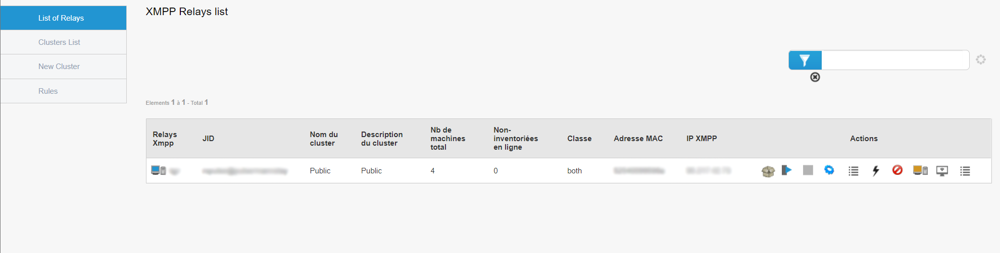

==========
Admin
==========

| Cette section concerne la partie Admin de l'outil Pulse.
| Le menu Admin regroupe les informations sur la liste des relais.
|

| Lorsqu'on clique sur le menu Admin, on retrouve directement la liste de nos différents relais.
| La page par défaut est "List of relays", soit la liste des relais.

Liste des relais
=================

| Sur cette page, on peut retrouver toutes les infos des relais : 
| - le nom du relais,
| - son JabberID,
| - le nom du cluster dans lequel est contenu le relais,
| - la description du cluster,
| - le nombre de machines sur le relais,
| - les machines non-inventoriées en ligne présentes sur le relais,
| - sa classe,
| - l'adresse MAC du relais,
| - son adresse IP,
| - les actions possibles à lancer sur le relais.
|
| Concernant le dernier point, les différentes actions sont les suivantes :
|
| **Liste de packages** : Affiche la liste des paquets présents sur le relais,
| **Reconfigurer les machines** : Permet de lancer la Quick Action de reconfiguration des machine sur toutes les machines présentes sur le relais,
| **Switch** : Permet d'éteindre le relais,
| **Editer les fichiers de configuration** : Permet d'éditer les fichiers de configuration du relais,
| **QA lancées** : Affiche la liste des Quick Actions lancées,
| **Actions** : Permet de lancer une action sur le relais (Reboot, Process, Disk Usage...),
| **Bannir** : Ban le relais. Celui-ci sera considéré comme hors-ligne,
| **Débannir** : Déban le relais. Il pourra à nouveau être utilisé,
| **Prise en main à distance** : Permet de prendre en main à distance le relais au travers VNC, RDP ou SSH,
| **Règles des relais** : Affiche la liste des règles sur le relais et permet également d'en ajouter.