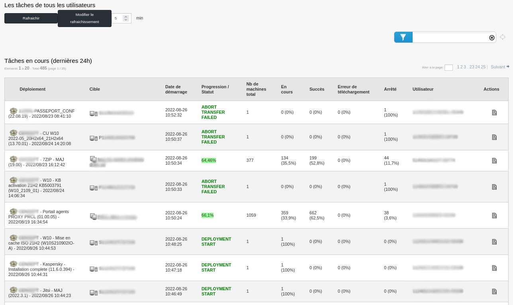
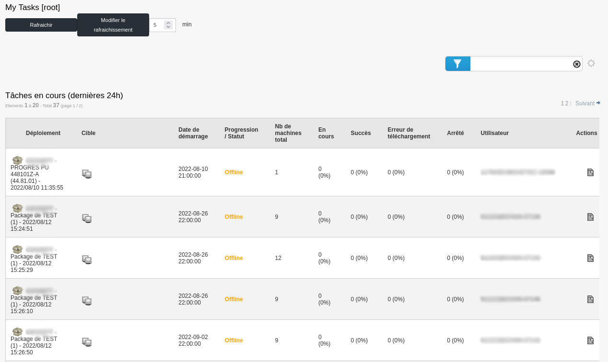
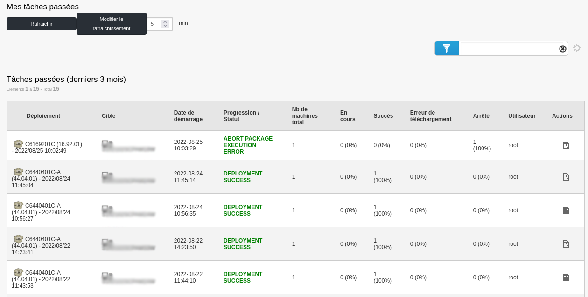
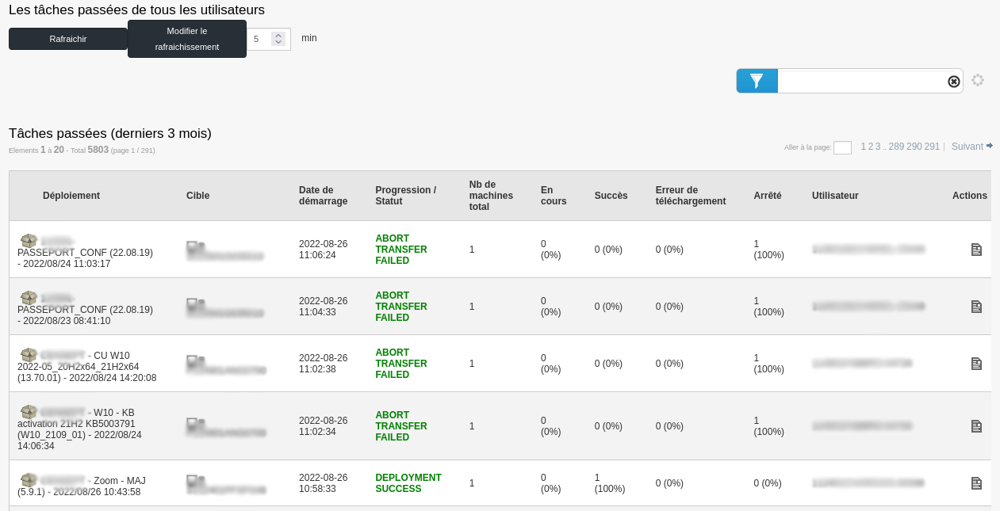
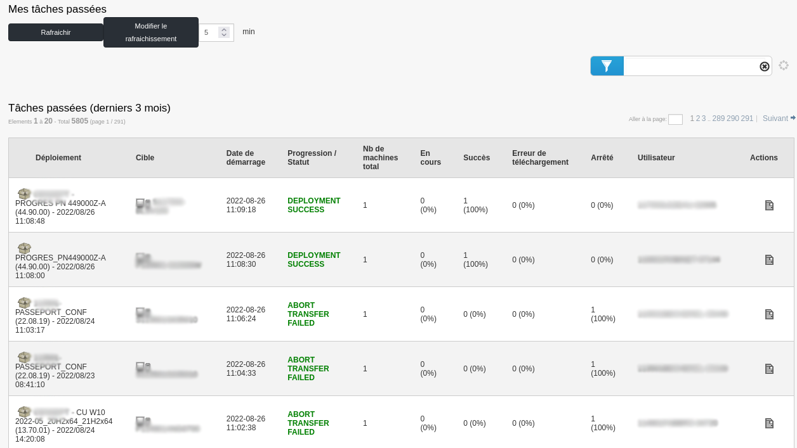
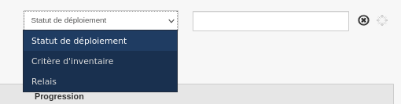
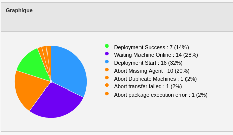

==========
Audit
==========

| Cette section concerne la partie Audit de l'outil Pulse.
|

| Le menu audit regroupe l’ensemble des actions de déploiements.
| Lorsque l’on clique dessus, on retrouve la page "Mes tâches" qui correspond aux différents déploiements en cours de réalisation et également les tâches planifiées.

.. image:: images/tachesencours.png

Dans le menu de gauche, on retrouvera un sous-menu avec : 

.. image:: images/sousmenu.png

*A noter que l'affichage diffère en fonction du profil utilisé. En l'occurence, j'utilise un profil d'administrateur.*

En haut de la page, nous pouvons également paramétrer le rafraichissement automatique de la page.

Egalement, sur chaque page, nous pouvons cliquer sur l'icône "Détail du déploiement" dans les **Actions** du déploiement.

Les tâches de tous les utilisateurs
=====================================

| Cette page regroupe les tâches de tous les utilisateurs utilisant Pulse. Seules les tâches des dernières 24h et en cours sont montrées.
|

Les tâches de mon équipe
=========================

| Cette page regroupe les tâches des utilisateurs faisant partie de l'équipe de l'utilisateur connecté. Seules les tâches des dernières 24h et en cours sont montrées.
|

Mes tâches passées
===================

| Cette page regroupe les tâches passées de l'utilisateur connecté, et ce au cours des 3 derniers mois.
|

Les tâches passées de tous les utilisateurs
============================================

| Cette page regroupe les tâches de tous les utilisateurs utilisant Pulse. Les tâches présentes sont celles terminées des 3 derniers mois.
|

Les tâches passées de mon équipe
==================================

| Cette page regroupe les tâches des utilisateurs faisant partie de l'équipe de l'utilisateur connecté. Les tâches présentes sont celles terminées des 3 derniers mois.
|

Page Audit sur déploiement de groupes
======================================

| Dans le menu Audit, il est possible de cliquer sur un déploiement pour en voir le détail.
| Pour un déploiement de groupe par exemple, on va retrouver des informations avec une présentation différente.

.. image:: images/auditgroupe.png

| Dans la première partie de cette page, nous allons avoir la vue sur la progression du déploiement, dans notre cas à 100%.
| Dans la deuxième partie, un camembert est présent (comme sur les widgets de dashboard).
| Dans la troisième partie de la page, nous aurons les machines avec les informations sur l’état du déploiement ainsi que le log des actions, comme pour un déploiement par machine.

Filtres
--------

| Il y a différentes façons de filtrer des ordinateurs dans l'audit de déploiement.
| Tout d'abord, la première façon consiste à filtrer les ordinateurs par **Statut de déploiement**, **Critère d'inventaire**, ou encore **Relais**.
| Ces trois filtres sont situés en haut à droite de la fenêtre de déploiement de groupe, dans le menu déroulant.
| 
| **Statut de déploiement** : Filtre les ordinateurs en fonction du statut de déploiement. Par exemple, on peut chercher les ordinateurs dont le déploiement est en succès avec le filtre "SUCCESS".
| **Critère d'inventaire** : Filtre les ordinateurs en fonction de leurs critères d'inventaire. C'est avec ce filtre que l'on peut, par exemple, filtrer en fonction de nom de la machine. 
| **Relais** : Filtre les ordinateurs en fonction du relais auquels ils sont rattachés.
|

|
| Egalement, Nous pouvons utiliser le camembert présent sur la page de déploiement afin de créer des groupes sur lesquels nous allons pouvoir agir.
|

|
| Si l'on clique sur la partie verte du camembert ci-dessus, nous aurons un groupe de machines contenant les machines dont le déploiement est en succès.
| Ce filtre est très utile pour corriger les postes en erreur.
| Par exemple, si nous avons un déploiement de groupe avec un échec de 30% de machines, alors en cliquant sur le bout du camembert correspondant nous créerons automatiquement 
| un groupe nous permettant de vérifier les erreurs et nous pourrons éventuellement relancer un processus de déploiement après avoir corrigé l’erreur.
