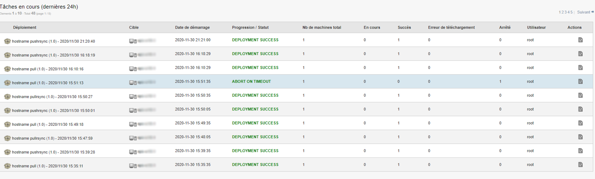

==========
Audit
==========

| Cette section concerne la partie Audit de l'outil Pulse.
|
|

| Le menu audit regroupe l’ensemble des actions de déploiements.
| Lorsque l’on clique dessus, on retrouve les différents déploiements qui ont été réalisés.

Dans le menu de gauche, on retrouvera un menu avec : 

.. image:: images/sousmenu.png

*A noter que l'affichage diffère en fonction du profil utilisé. En l'occurence, j'utilise un profil d'administrateur*

En haut de la page, nous pouvons également paramétrer le rafraichissement automatique de la page.

Page Audit sur déploiement de groupes
======================================

| Dans le menu Audit, il est possible de cliquer sur un déploiement pour en voir le détail.
| Pour un déploiement de groupe par exemple, on va retrouver des informations avec une présentation différente.

.. image:: images/auditgroupe.png

| Dans la première partie de cette page, nous allons avoir la vue sur la progression du déploiement, dans notre cas à 100%.
| Dans la deuxième partie, un camembert est présent (comme sur les widgets de dashboard).
| Si, par exemple, nous avons un déploiement de groupe avec un échec de 30% de machines, alors en cliquant sur ce bout du camembert nous créerons automatiquement 
| un groupe nous permettant de vérifier les erreurs et nous pourrons éventuellement relancer un processus de déploiement après avoir corrigé l’erreur.
| Dans la troisième partie de la page, nous aurons les machines avec les informations sur l’état du déploiement ainsi que le log des actions, comme pour un déploiement par machine.
