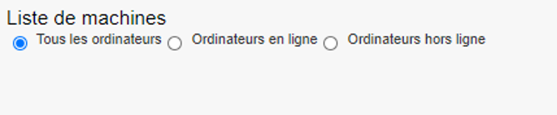
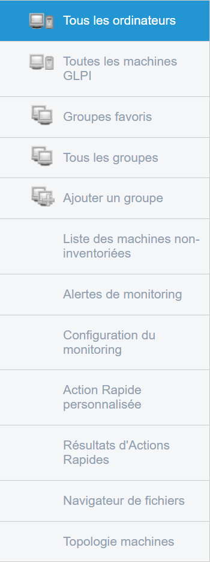
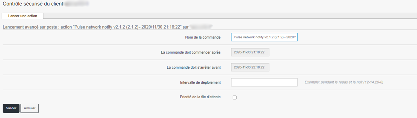
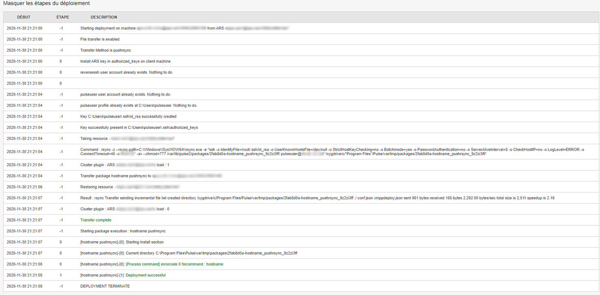
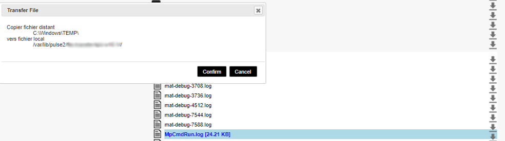
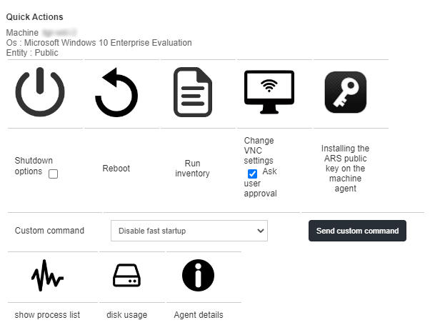

=====================================
Menu Ordinateurs
=====================================

| Cette section concerne les différentes parties du menu Ordinateurs de l'outil Pulse.
|
|

| Sur l’écran principal sous le bandeau de menu, 
| nous allons pouvoir filtrer la vue, par exemple si l'on souhaite voir tous les ordinateurs de la liste ou bien seulement les ordinateurs en ligne ou hors-ligne.

.. image:: ../interface/images/machines.png
    :align: center

| Lorsque nous arrivons sur le menu Ordinateurs sur l’écran principal, nous allons retrouver le bandeau avec les différents postes de travail qui sont listés.
| Dans la copie d’écran ci-dessus, on retrouve un poste de travail.
| Sur le côté gauche de l’écran, nous allons retrouver un menu comportant différents sous-menus qui composent le menu Ordinateurs.

| **Tous les ordinateurs** : Affiche les machines présentes dans Pulse;
| **Toutes les machines GLPI** : Affiche les machines présentes dans GLPI;
| **Groupes favoris** : Affiche les groupes d’ordinateur favoris ;
| **Tous les groupes** : Affiche tous les groupes d’ordinateurs ;
| **Ajouter un groupe** : Permet d’ajouter un groupe d’ordinateurs ;                          
| **Liste des machines non-inventoriées** : Affiche les ordinateurs absents de l’inventaire ;
| **Alertes de monitoring** : Affiche les alertes de monitoring ;
| **Configuration du monitoring** : Configure les alertes de monitoring ;
| **Action Rapide personnalisée** : Liste les actions rapides personnalisées ;
| **Résultats d'Actions Rapides** : Affiche les résultats des actions rapides ;
| **Navigateur de fichiers** : Ouvre le navigateur de fichiers ;
| **Topologie machines** : Offre une vue par topologie de machines.
|
| La vue Ordinateurs vous permet d'avoir la liste complète des machines avec la possibilité de voir ce que possède chaque machine en cliquant sur celle-ci. 
| C'est également depuis cette vue que des opérations pourront être effectuées sur les machines via le menu d'actions.

Si nous effectuons un clic sur le mode Expert, une fonction est alors ajoutée : "Réveil réseau"

.. image:: images/reveilreseau.png
    :align: center

Réveil réseau permet d'allumer une machine en utilisant son adresse MAC.

Nous allons maintenant passer en revue les différentes actions disponibles dans la vue Ordinateurs pour chaque machine :

.. list-table:: 
   :widths: 25 25 50
   :header-rows: 1

   * - Icône
     - Nom de l'action
     - Description de l'action
   * - .. image:: images/icon1.png
     - Inventaire
     - Visualiser l'inventaire de la machine
   * - .. image:: images/icon2.png
     - Monitoring
     - Récupérer les graphiques de monitoring
   * - .. image:: images/icon3.png
     - Sauvegarde
     - Visualiser l'inventaire de la machine  
   * - .. image:: images/icon4.png
     - Prise en main à distance
     - Prendre la main sur la machine de diverses manières (ssh, rdp,vnc,cmd)
   * - .. image:: images/icon5.png
     - Déploiement de logiciels
     - Déployer un paquet
   * - .. image:: images/icon6.png
     - Imaging
     - Accéder au menu d'imaging
   * - .. image:: images/icon7.png
     - Actions rapides
     - Lancer une action rapide sur une machine
   * - .. image:: images/icon8.png
     - Explorateur de fichiers
     - Explorer le dossier défini de l'ordinateur
   * - .. image:: images/icon9.png
     - Supprimer
     - Supprimer une machine de Pulse

En mode Expert, on trouvera le menu avec trois fonctions supplémentaires listées ci-dessous :

.. list-table:: 
   :widths: 25 25 50
   :header-rows: 1

   * - Icône
     - Nom de l'action
     - Description de l'action
   * - .. image:: images/icon10.png
     - Visualisation de fichiers
     - Visualiser le fichier récupéré sur le serveur
   * - .. image:: images/icon11.png
     - Console XMPP
     - Permettre certaines commandes directement depuis le serveur ou un ordinateur.
   * - .. image:: images/icon12.png
     - Édition de la configuration des fichiers de l’agent
     - Configurer des options des fichiers de configuration de l’agent de l’ordinateur.

Inventaire
===========

.. image:: images/inventaire.png

| L'objectif de l'inventaire est d'avoir une connaissance précise de son parc informatique. Dès lors que l'agent d'inventaire est installé sur les postes clients, 
| Pulse dresse automatiquement et en fonction de la configuration de l’agent d’inventaire un état du parc. 
| Ces relevés sont ensuite utilisés pour afficher des statistiques sur le tableau de bord et signaler à l'administrateur système 
| les postes qui ne sont pas à jour dans leur inventaire. Cet inventaire va directement être cherché dans la base GLPI. 
| On va retrouver sur l’inventaire plusieurs onglets départageant l’inventaire en fonction du type :
| matériel, connections, stockage, réseau, logiciels, administratif, historique, antivirus, registre.
| *Des scripts pour améliorer la cohérence sont fournis avec Pulse.*

Garantie
---------

Pour les constructeurs qui offrent une API de gestion de garantie, un lien se forme et pointe directement vers la page du constructeur.

.. image:: images/garantie.png

Lien exemple Dell : https://www.dell.com/support/home/fr-fr/product-support/servicetag/0-cksrVUVkKzlCZDF3QmhKRkhjb1RBZz090/overview

| Les API changent régulièrement, il est possible de personnaliser les liens 
| dans le fichier de configuration du plugin GLPI (situé dans /etc/mmc/plugins/glpi.ini.local)

    * # Manufacturer warranty infos
    * # @@SERIAL@@ keyword will be replaced by computer's serial
    * # When type = post, params will be posted, by default params are
    * # get params for the url.
    * [manufacturer_dell]
    * url = http://www.dell.com/support/my-support/us/en/19/product-support/servicetag/@@SERIAL@@/warranty
    * [manufacturer_dell_fr]
    * url = http://www.dell.com/support/my-support/fr/en/19/product-support/servicetag/@@SERIAL@@/warranty
    * params = l=fr
    * [manufacturer_lenovo]
    * url = http://support.lenovo.com/templatedata/Web%20Content/JSP/warrantyLookup.jsp
    * type = post
    * params = sysSerial=@@SERIAL@@
    * #[manufacturer_hp]
    * #url = http://h20566.www2.hp.com/portal/site/hpsc/public/wc/home/
    * #type = post
    * #params = serialNumber0=@@SERIAL@@
    * [manufacturer_fujitsu]
    * url = http://sali.uk.ts.fujitsu.com/ServiceEntitlement/service.asp
    * params = command=search&snr=@@SERIAL@@
    * [manufacturer_toshiba]
    * url = http://aps2.toshiba-tro.de/unit-details-php/unitdetails.aspx
    * params = serialNumber=@@SERIAL@@
    * [manufacturer_apple]
    * url = https://expresslane.apple.com/GetSASO
    * params = serialno=@@SERIAL@@

Monitoring
===========

| La fonctionnalité de monitoring est basée sur l’outil de monitoring Grafana.
| Si l'on clique sur l'action Monitoring, la liste des graphiques est affichée :

.. image:: images/monitoring.png

*Dans mon cas, je n'ai qu'un item de monitoring*

| L'affichage de la dernière valeur dépend du graphique. Cette valeur est affichée pour le graphique Online-Offline Status. 
| Ceci sera enrichi au fur et à mesure de la standardisation des graphiques. 
| Dans tous les cas, la dernière valeur de chaque item sera affichée en légende de chaque graphique:

Prise en main à distance
=========================

.. image:: images/pmad.png

| Lorsque l’on clique sur le bouton de prise en main à distance d’un poste sur Pulse,
| les différents protocoles accessibles sur la machine vont nous être proposés.
| Dans l’exemple ci-dessus, on peut accéder au poste via VNC, via commande CMD ou via RDP (Remote Desktop Protocol)

| Une fois le choix du protocole de prise en main à distance sélectionné, Pulse va lancer la connexion 
| avec l’application sélectionnée. Un nouvel onglet s’ouvrira alors dans votre navigateur.

VNC
----

.. image:: images/vnc.png

| Lorsque l’on sélectionne l'outil VNC, Pulse va ouvrir un nouvel onglet avec l’accès à la console VNC.
| Si le poste n'est pas utilisé, le prérequis est de lancer l'Action Rapide afin d'enlever la demande de validation coté utilisateur.

RDP
----

.. image:: images/rdp.png

CMD/SSH 
--------

.. image:: images/cmd.png

| Lorsque l'on clique sur le bouton CMD et que la machine est sous Windows, alors on va automatiquement arriver sur une invite de commande DOS Windows.
| Il suffira d'appuyer sur la touche "Entrée" pour charger le cmd.exe, et ensuite taper n’importe quelle commande *(par exemple ipconfig /all)*

.. image:: images/ipconfig.png

Déploiement de logiciels
=========================

.. image:: images/deploy.png

| Lorsque l’on clique sur le bouton "Déploiement de logiciels", on arrive directement sur une vue des packages disponibles dans Pulse pour le poste
| avec la possibilité de programmer un déploiement ou bien de déployer immédiatement le package sur le poste.
| Pour programmer le déploiement, il suffit de cliquer sur la roue dentée et pour déployer immédiatement, il faut cliquer sur le bouton Play.

Programmer le déploiement
--------------------------

| Dans le menu de programmation du déploiement, on a la possibilité de modifier le nom de la commande si on veut suivre le déploiement avec un nom facilement identifiable.
| On peut également programmer un intervalle d’exécution du déploiement ou encore sélectionner une priorité dans la file d’attente.

Déployer
---------

| En cliquant sur le bouton déployer, on exécute immédiatement le déploiement d’un package ou commande sur un poste et on visualise directement l’exécution de la commande.
| Cette exécution va nous donner :

- Les informations concernant le poste sur lequel on déploie la commande et celles concernant le package déployé

.. image:: images/deploiement.png

- Les informations concernant le serveur relais ainsi que le plan de déploiement qui a été sélectionné

.. image:: images/infos.png

- Le package et ses dépendances 

.. image:: images/package.png

- Un résumé des étapes du déploiement 

- Le résultat du déploiement

.. image:: images/resultat.png

Si l'on clique sur les étapes 0 ou 1, les informations seront plus détaillées sur le retour de chaque étape du déploiement.

.. image:: images/resultatdetails.png

Déploiement avec profil Expert
-------------------------------

.. image:: images/deployexpert.png

| Avec le mode expert, des options se rajoutent lors de la programmation du déploiement, comme la notion de limitation de la bande passante, 
| de phase de redémarrage, de paramètres dynamiques *(par exemple pour les commandes)* ou encore de retard d’installation.

| Pour détailler le retard d'installation, il faut savoir que le retard de l’installation entrainera deux paramètres : 
| - Une contrainte de temps, qui va permettre de donner un temps nécessaire pour que l’ensemble des packages soit reçu par toutes les machines avant de déclencher l’installation, et ce en fonction d’une date définie ;

.. image:: images/retardinstall.png 

| - Une possibilité de pouvoir prioriser un déploiement, dans le cas où nous avons plusieurs déploiements en cours et que l’on veut en prioriser un.

.. image:: images/priorisation.png

Explorateur de fichiers
========================

L’explorateur de fichier permet d’aller sélectionner, sur la machine cliente, un ou plusieurs fichiers (ou dossiers) pour ensuite le ou les télécharger.

.. image:: images/explorer.png

Lorsque l’on clique sur le bouton télécharger, une pop-up va nous demander confirmation du téléchargement en résumant les informations que l’on a sélectionné.

Une fois confirmé, la pop-up nous envoie le retour et nous donne les informations de stockage du fichier sur le serveur.

.. image:: images/confirm2.png

| Lors d'un clic sur le bouton ok, on se retrouve sur le menu Ordinateurs. Dans le menu de gauche, il suffit de cliquer sur Navigateur de fichiers pour aller retrouver le fichier que l’on a téléchargé.
| En cliquant sur Navigateur de fichiers, nous pouvons voir sur le côté gauche l’ensemble des postes sur lesquels nous avons téléchargé des fichiers.

.. image:: images/fileexplorer.png

On peut ensuite dérouler l'arborescence pour voir notre fichier.

.. image:: images/arborescence.png

| En faisant un clic droit sur le fichier, on peut alors exécuter diverses actions : 
| - Voir le fichier ;
| - Télécharger le fichier sur son poste ;
| - Copier, couper, coller ;
| - Le renommer, l’éditer ou le supprimer.

.. image:: images/fichier.png

Actions Rapides *(ou Quick Actions)*
=====================================

| Lors d'un clic sur le menu Actions Rapides, nous allons trouver plusieurs actions rapides génériques comme : l'arrêt du poste, le redémarrage du poste, le lancement d’un inventaire,
| le changement des paramètres VNC pour demander ou non l’autorisation de l’utilisateur pour prendre la main sur le poste, l’installation de la clé publique du serveur relais auquel le poste est rattaché,
| mais aussi la possibilité de lancer des commandes personnalisées, par exemple pour voir les processus en activité sur la machine ou l’usage disque de la machine, et beaucoup d'autres.

Comme exemple, voici un retour de la QA "Show process list" :

.. image:: images/showprocess.png

Supprimer un ordinateur
========================

| L'icône "Croix" est plutôt direct : en effet, un clic sur cette icône nous ouvre une pop-up afin de confirmer la suppression de la machine.
| Lors de cette suppression, nous avons alors la possibilité de sauvegarder la machine et/ou de supprimer toutes les images associées au poste (si de l'imaging a été effectué à partir de cette machine).

.. image:: images/delete.png