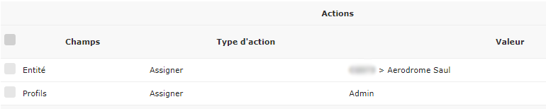
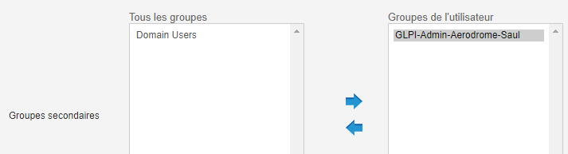

===========================================
Corrélation avec l'outil de gestion de parc
===========================================

| Cette section concerne la partie configuration GLPI de l'outil Pulse.
| 

GLPI local
===========

| Par défaut, Pulse comporte une configuration existante pour utiliser le GLPI local
| Il suffit de se connecter à l'adresse suivante : http://ippulse/glpi
|
| Pour s’identifier :
| -	Login : root
| -	Mot de passe : celui de l’installation de Pulse

GLPI existant
==============

| Afin de connecter Pulse à un GLPI existant, il faut le configurer dans le fichier suivant :
|
| # vi /etc/mmc/plugins/glpi.ini.local
|
| Les éléments principaux sont :
|
| [main]
| dbhost = 		← IP de base SQL de GLPI
| dbname =		← nom de la bdd de GLPI
| dbuser =		← utilisateur de la bdd de GLPI
| dbpasswd =		← mot de passe bdd de GLPI
| glpi_computer_uri =	← URL lien entre Pulse et GLPI
| 
| [webservices]
| purge_machine =	← suppression depuis Pulse
| glpi_base_url =	← URL de base de GLPI
| glpi_username =	← utilisateur admin de GL
| glpi_password = 	← mot de passe admin
| 
| [authentication_glpi]
| baseurl = 		← URL pour l'identification
| 
| Egalement, il faut faire en sorte que le serveur d'inventaire soit relayé au bon serveur GLPI. La configuration se fait dans le fichier suivant:
| 
| # vi /etc/mmc/pulse2/inventory-server/inventory-server.ini.local
|
| [main]
| url_to_forward =
| http://serverglpi/glpi/plugins/fusioninventory/front/plugin_fusioninventory
| .communication.php

Affichage des machines
=======================

| Pulse permet un affichage sélectif des ordinateurs de GLPI suivant les filtres suivants :
| -	state
| -	type
| -	entity
|
| Convention pour l'utilisation des filtres :
| i.e. state=1 type=2|3|7 entity=2|5
| filter_on = state=3

Entités et lieux
=================

| Les entités de premier niveau sont réservées aux sites physiques où est installé Pulse, ou un Pulse multi-site.
|
| GLPI permet d'assigner les ordinateurs à des entités et lieux en fonction de critères discriminants (adresse IP, masque de sous-réseau...). Il peut aussi utiliser le TAG de l'agent d'inventaire.
| Ces différentes règles fonctionnent sous forme de pile. L’ordre de ces piles va du haut vers le bas et s’arrête dès qu’un critère correspond à une de ces règles.
| Les règles se composent d’un ensemble de nom, critère(s) et action(s).

Règle sur l'entité
-------------------

| Les critères discriminants possibles sont les suivants :
|
| -	Adresse IP
| - Domaine
| -	Nom de l’ordinateur
| -	Serial Number
| -	Sous-réseau
| -	Système d’exploitation / Comment
| -	Étiquette Fusioninventory

Exemple :
~~~~~~~~~~

.. image:: images/regles.png

| Les actions possibles sont les suivantes :
| -	Entité
| -	Lieu
| -	Entité depuis TAG
| -	Ignorer lors de l’import

Règles de lieu
---------------

Identique aux entités, cette section permet de séparer des entités pour plus de détails.

Gestion des groupes
====================

La gestion des groupes permet de faire coïncider les groupes GLPI aux groupes Pulse.

| Exemple :
|
| -	Groupe GLPI-Hotliner minimum pour accès à Pulse
| - Assigne des droits dans GLPI en fonction du groupe.
| - GLPI-Hotliner => accès au Bureau à distance
| - GLPI-Supervisor & GLPI-Technician => accès à Pulse
| - GLPI-Admin & GLPI-Super-Admin => accès à Pulse avec gestion des utilisateurs

Création d'un groupe Pulse
---------------------------

Il faut créer les groupes nécessaires à l'utilisation de Pulse.

.. image:: images/groupe.png

Le groupe doit commencer par « GLPI- ». Il est conseillé de respecter la nomenclature de l'exemple.

Synchroniser les groupes GLPI
------------------------------

| Pour synchroniser les groupes GLPI, il faut aller dans l'onglet "Administration", "Groupes" puis "Liaison annuaire LDAP" pour enfin cliquer sur le bouton "Importation de nouveaux groupes".
| Il faut alors importer les nouveaux groupes.

Gestion des utilisateurs
=========================

Règles d'affectation et profils
--------------------------------

Depuis GLPI, Administration >> Règles >> Règles d'affectation d'habilitations à un utilisateur, ajouter une nouvelle règle :

.. image:: images/nouvelleregle.png

Puis ajouter un critère d'appartenance au nouveau groupe :

.. image:: images/critere.png

Et enfin ajouter une action qui assigne les utilisateurs à l'entité voulue ainsi qu'une action attribuant un profil de droits à ces utilisateurs :

Ajouter l'utilisateur au groupe dans Pulse
-------------------------------------------

Pour ajouter un utilisateur à un groupe dans Pulse, il faut éditer un utilisateur et ajouter son groupe :

| Les groupes définis par défaut donnent un accès complet à l'ensemble des entités.
|
| Lors de la connexion dans Pulse, cet utilisateur sera cantonné à l’entité correspondante, la même restriction s'applique dans GLPI.
|
| Il est évidemment possible de réitérer l'opération avec un second groupe et une seconde entité.

Dictionnaire applicatif Pulse
==============================

| Dans le répertoire suivant, un ensemble de filtre permet le renommage et la standardisation de valeurs d’inventaire. Ces règles sont appliquées à la volée sur les inventaires.
| 
| # cd etc/mmc/pulse2/inventory-server/xml-fix
| # ls
| 00_Replace_bad_characters.py  
| 01_Dell_consistency.py	     
| 02_ATI_consistency.py   
| 03_ASUS_consistency.py  
| 04_Adobe_consistency.py  
| 05_HP_consistency.py     
| 06_Laptop_type.py	   
| 07_Virtual_machine_type.py  
| 08_Microsoft_consistency.py
| 99_Strip_leading_trailing_spaces.py
| 
| Exemple de standardisation du constructeur DELL :
| 
| def xml_fix(xml):
|   import xml.etree.cElementTree as ET
|   xml = ET.fromstring(xml)
|   tree = ET.ElementTree(xml)
|   root = tree.getroot()
|   for subelem1 in root:
|     if subelem1.tag == 'CONTENT':
|       for subelem2 in subelem1:
|           for subelem3 in subelem2:
| 
|             # DELL vendor name should always be the same
|             if subelem3.text in ['DELL', 'Dell Corp.', 'Dell Computer Corp.', 'Dell', 'Dell Computer Corporation']:
|               subelem3.text = 'Dell Inc.'
| 
|   return ET.tostring(root)

