===========
Imaging
===========

| Cette section concerne la partie imaging de l'outil Pulse, avec notamment le boot en iPXE, la page d'accueil et les différentes options.
|
|

Interface
==========

| Lorsque nous arrivons sur le menu Imaging sur l’écran principal, nous allons nous retrouver sur la page de statut du serveur d'imaging.

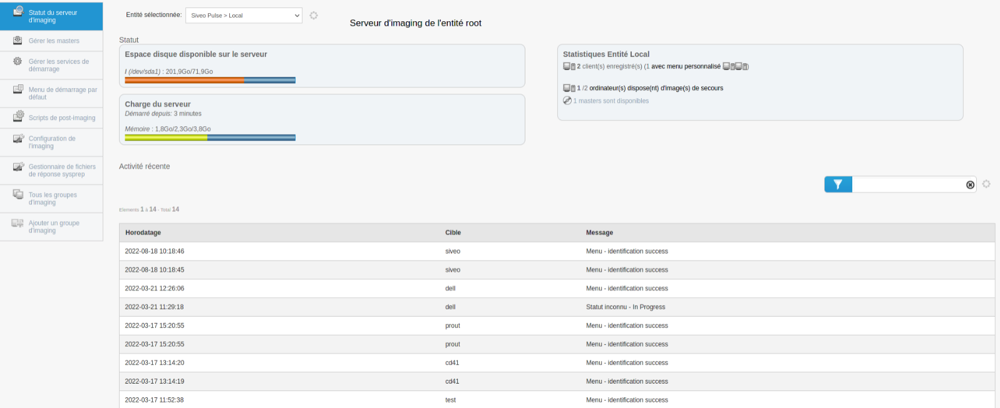

| Cette page permet de connaître l'état du serveur d'imaging, avec notamment l'espace disque disponible sur le serveur, la charge du serveur ou encore les statistiques entité.
|
| Sur la gauche de l'écran, on retrouve un menu comportant différents sous-menus qui composent le menu Imaging :

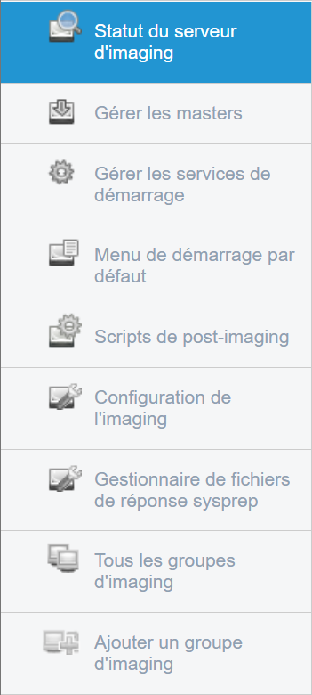

| **Statut du serveur d'imaging** : Affiche le statut du serveur d'imaging ;
| **Gérer les masters** : Permet de gérer les différents masters des machines ;
| **Gérer les services de démarrage** : Permet de gérer les services présents dans "Pulse Utilities" lors du boot PXE ;
| **Menu de démarrage par défaut** : Permet de configurer quel est le menu de démarrage par défaut ;
| **Scripts de post-imaging** : Permet d’ajouter des scripts à exécuter après l'imaging ;                          
| **Configuration de l'imaging** : Permet la configuration du serveur d'imaging (par exemple, ajout de mot de passe PXE) ;
| **Gestionnaire de fichiers de réponse sysprep** : Génère un fichier de réponse personnalisé pour Windows ;
| **Tous les groupes d'imaging** : Affiche les différents groupes d'imaging ;
| **Ajouter un groupe d'imaging** : Permet de créer un groupe de différentes machines pour leur attribuer un imaging.
|

Gérer les masters
------------------

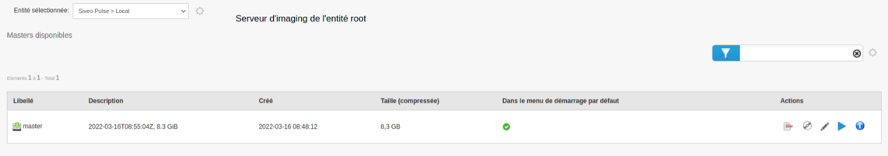

| Sur ce menu, nous pouvons gérer les masters grâce à différentes actions :
|
| **Enlever du menu de démarrage** : Enlève le master du menu de démarrage des machines ;
| **Créer une ISO bootable** : Permet de créer une ISO du master ;
| **Editer le master** : Permet d'éditer le master : son libellé, sa description ou encore l'ordre des différentes actions ;
| **Clone master** : Permet de cloner le master ;
| **Afficher les cibles utilisant cette image** : Afficher les machines utilisant l'image.
|

Gérer les services de démarrage
--------------------------------

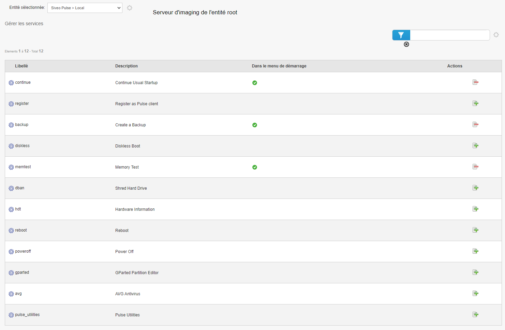

| Cette section permet de gérer les services présents dans "Pulse Utilities" lors du boot PXE.
| Pour ajouter un service, il faut cliquer sur l'action "Ajouter le service au menu de démarrage par défaut"
|
| Une pop-up apparaît avec différentes options :

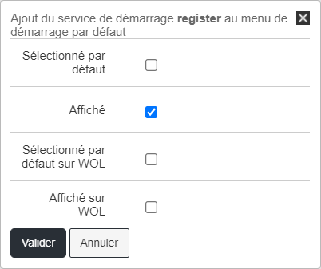

| Il faut sélectionner les options qui nous intéresse et cliquer sur "Valider".
|
| Pour retirer un service, il faut cliquer sur l'action "Enlever le service au menu de démarrage par défaut"

Menu de démarrage par défaut
--------------------------------

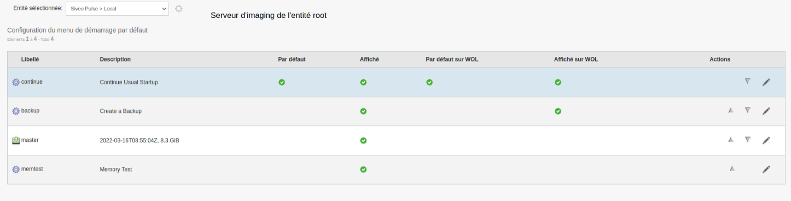

| Cette page contient les différentes options du menu de démarrage par défaut.
| On peut changer leur ordre ou encore les éditer (pour par exemple les afficher ou non).

Scripts de post-imaging
-------------------------

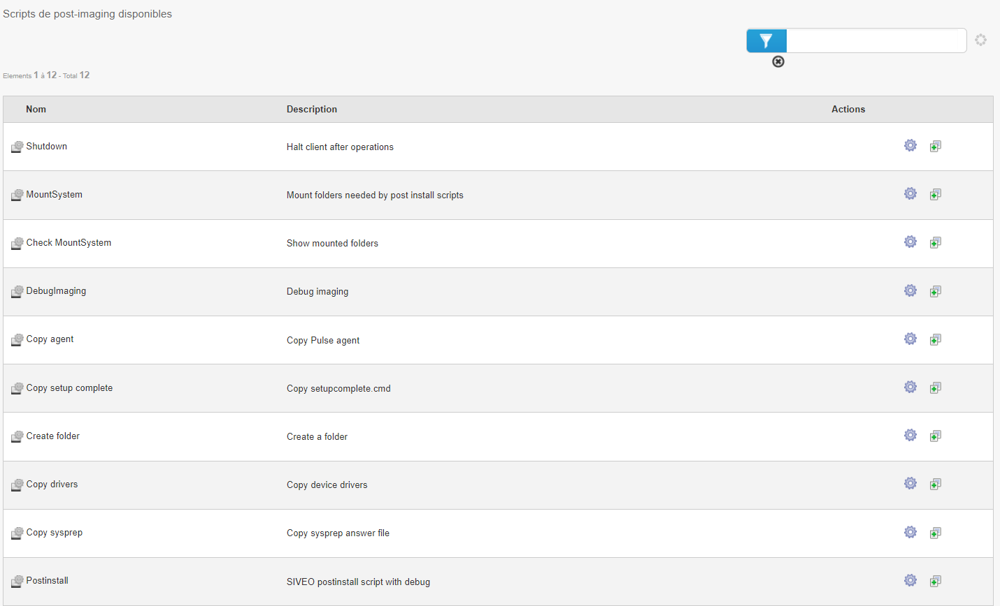

|
| Les scripts de post-imaging sont les scripts qui seront lancés directement après l'imaging de la machine.
| On peut par exemple mettre un script qui permet d'éteindre la machine une fois l'imaging effectué, ou encore un script permettant de copier le fichier de réponse sysprep.

Configuration de l'imaging
---------------------------

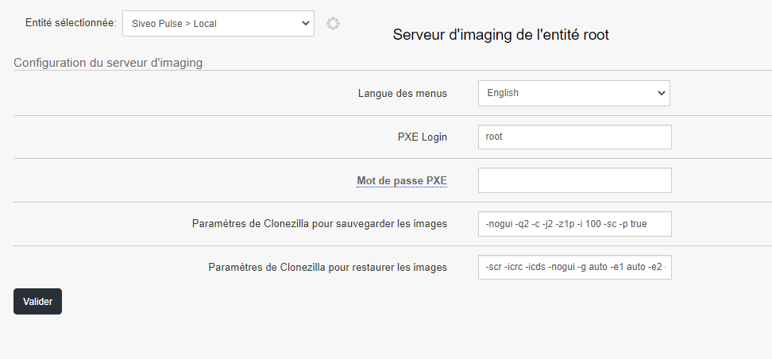

|
| Cette page permet de modifier différentes options de l'imaging.
| On peut notamment modifier la langue des menus, le login PXE, le mot de passe PXE, ou encore
| les paramètres de Clonezilla pour sauvegarder et restaurer les images.

Gestionnaire de fichiers de réponse sysprep
----------------------------------------------

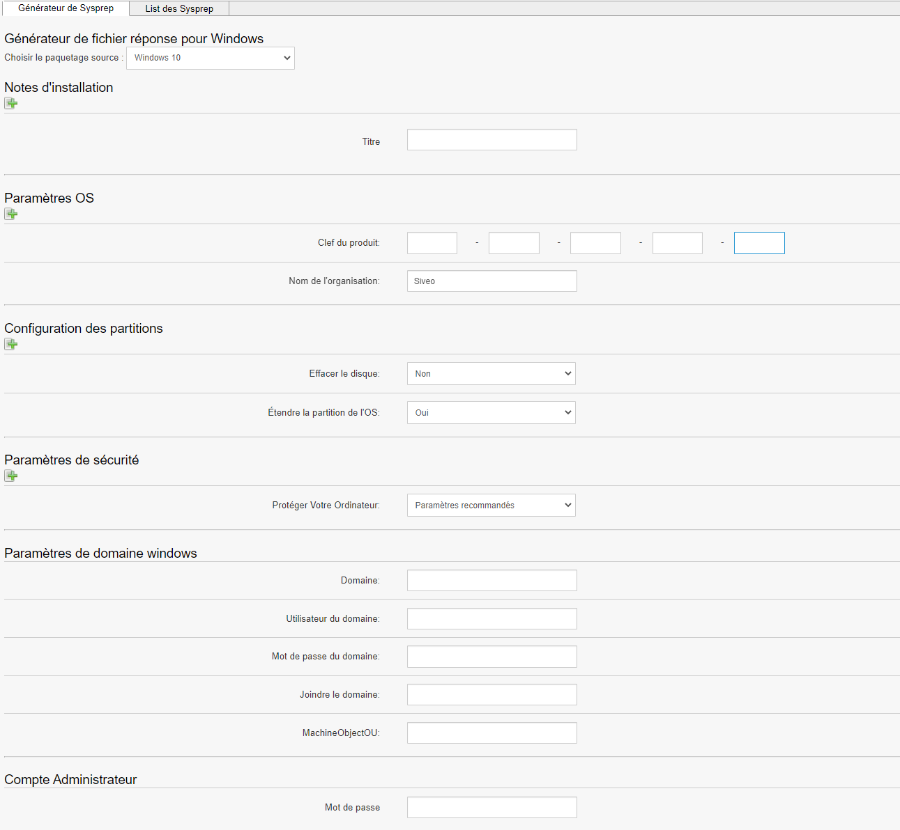

|
| Cette page permet de générer et modifier des fichiers de réponse sysprep.
| Sysprep permet de généraliser une installation Windows.
| La généralisation de l’image supprime des informations spécifiques à l’ordinateur, telles que les pilotes installés et l’identificateur de sécurité de l’ordinateur (SID).
| Sur ce générateur, on peut notamment mettre une clé produit, effacer ou non le disque, étendre la partition de l'OS, régler les paramètres de sécurité, ect.
|
| Dans l'onglet "Liste des Sysprep", nous retrouvons les différents sysprep que nous avons générés en amont.
| On peut les afficher, les modifier ou les supprimer.

Tous les groupes d'imaging
---------------------------

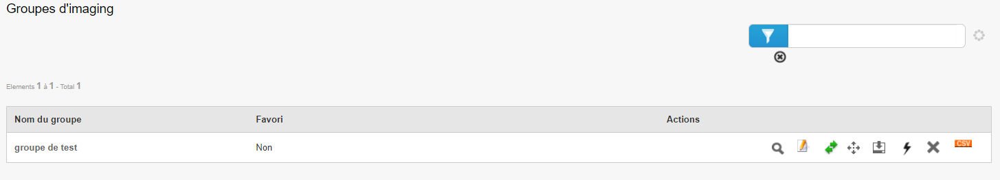

|
| Cette page permet d'afficher les différents groupes d'imaging.

Ajouter un groupe d'imaging
----------------------------

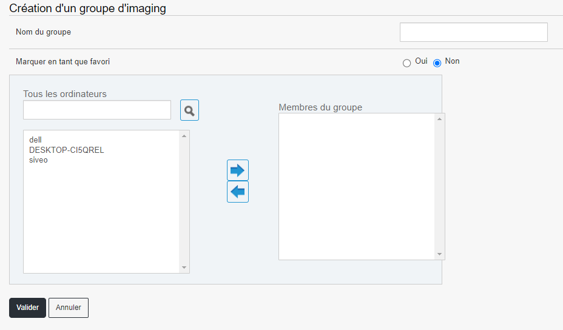

|
| Dans ce menu, nous pouvons créer un groupe d'imaging en y ajoutant des machines.
| Créer un groupe d'imaging permet d'appliquer la même configuration d'imaging (donc le même menu PXE) sur plusieurs machines et de lancer un déploiement d'image en multicast sur un groupe de machines.

Boot initial sur une machine (non enregistrée dans Pulse)
==========================================================

| Lors du lancement d'une machine en amorçage PXE (sigle de Pre-boot eXecution Environment, qui permet à une station de travail 
| de démarrer depuis le réseau en récupérant une image de système d'exploitation qui se trouve sur un serveur)
| nous avons plusieurs choix qui s'offrent à nous.
|
| Tout d'abord, quand la machine n'est pas enregistrée (*Reconnaissable grâce au message "Host is NOT registered"*) :
|
| - L'option par défaut est "Continue Usual Startup", qui permet de booter la machine normalement. Cette option par défaut sera automatiquement
| sélectionnée après un certain temps, sauf si l'on appuie sur une touche.

|
| - La seconde option, "Register as Pulse client", permet d'enregistrer la machine en tant que client Pulse. Un inventaire de la machine va être fait et celle-ci
| sera intégrée à l'outil Pulse.

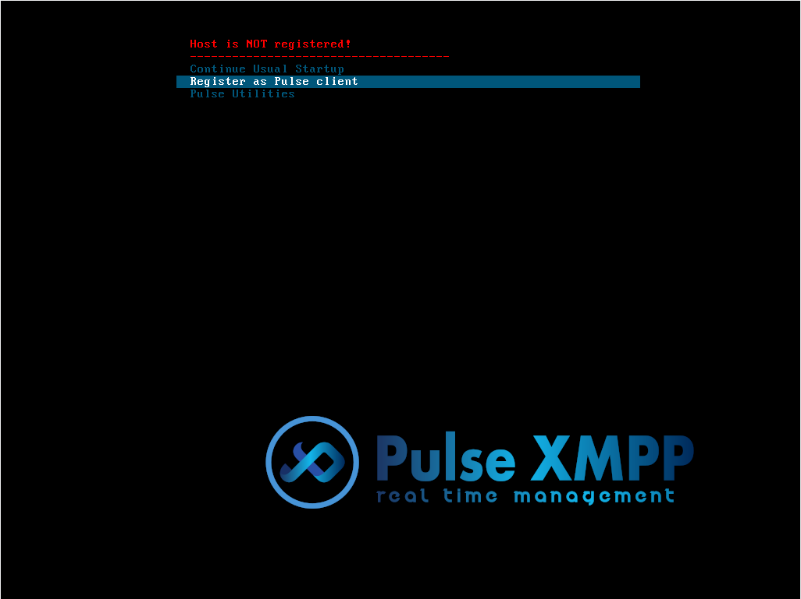

|
| Une fois cette option sélectionnée, il est alors demandé d'entrer le nom de la machine :

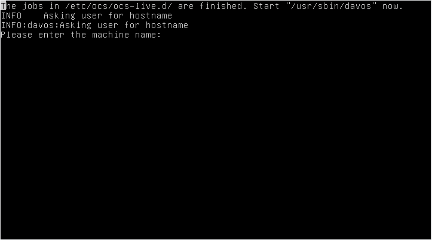

|
| S'en suit un message demandant si le nom est correct, afin d'éviter une quelconque erreur (taper "Y" pour continuer ou "N" pour corriger le nom)

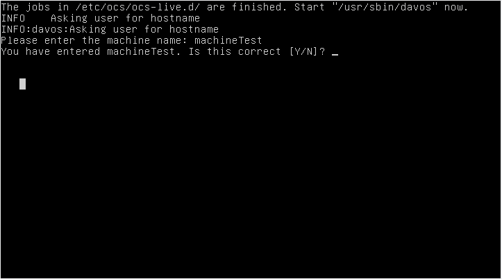

Machine enregistrée dans Pulse
===============================

| Une fois la machine enregistrée (*Reconnaissable grâce au message "Host _hostname_ registered!"*), nous pouvons :
|
| - Booter la machine normalement, avec l'option "Continue Usual Startup" (similaire à l'option du boot initial)

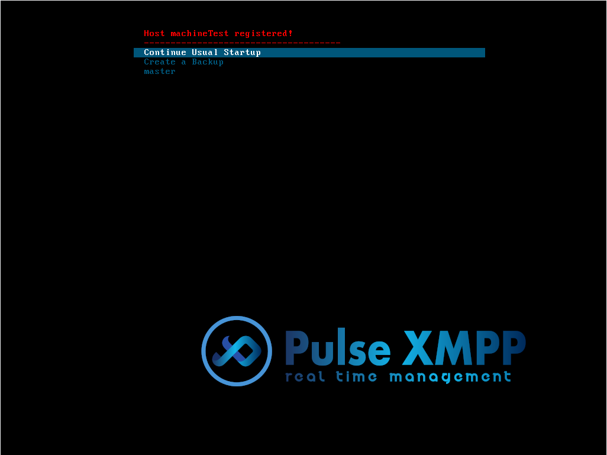

|
| - Créer une sauvegarde de la machine

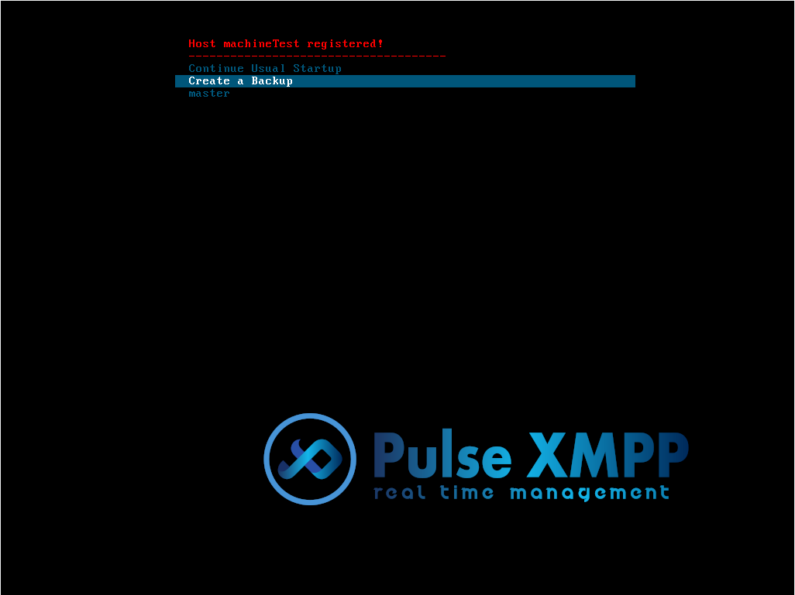

|
| - Ou encore de restaurer une image créée en amont sur la machine nouvellement créée. Dans notre exemple, le master s'appelle "master"

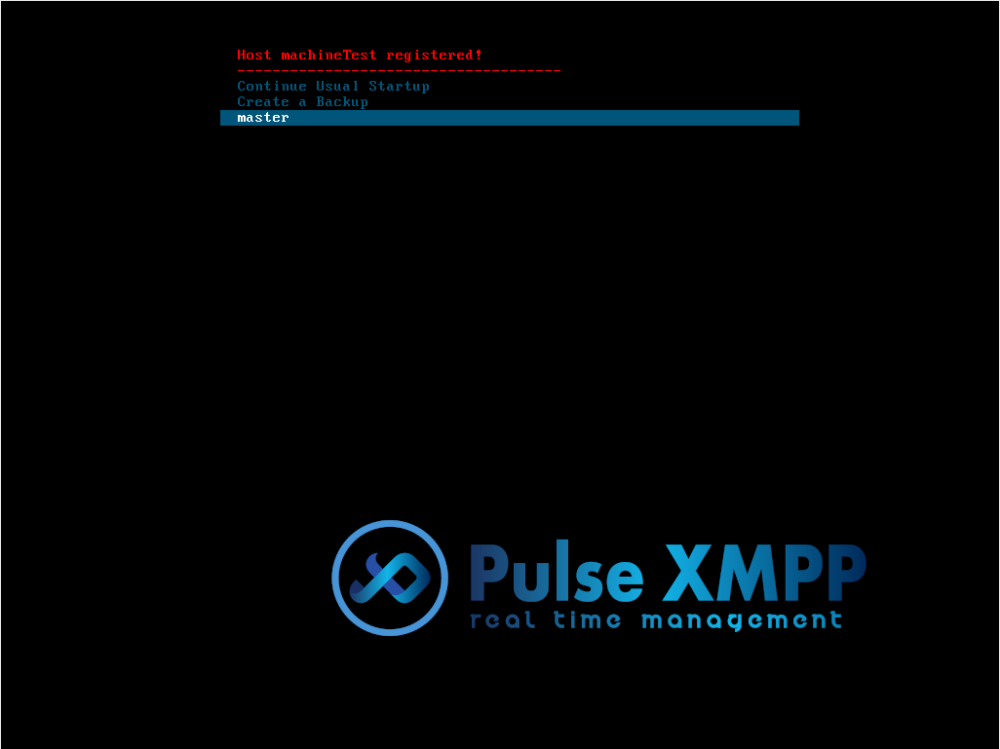