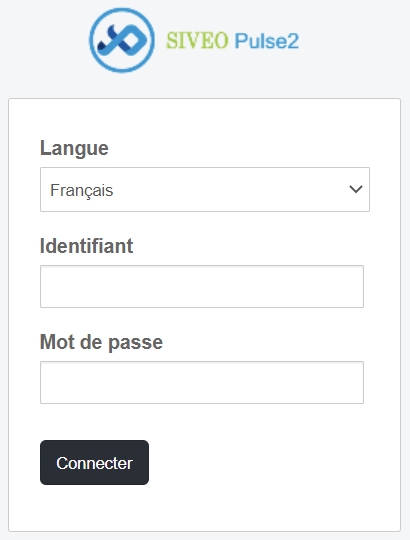
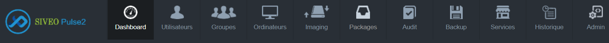
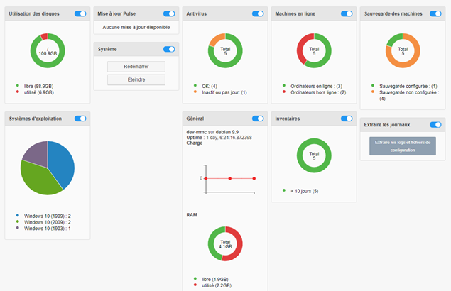
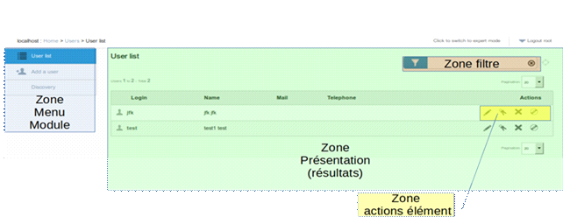
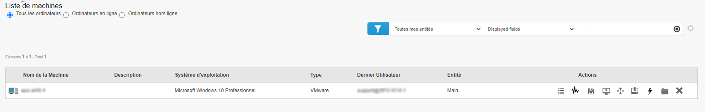

=====================================
Interface de Pulse
=====================================

Navigateur web
============================

L'interface utilisateur de Pulse est une interface web.
Les navigateurs suivants sont compatibles :
•	Microsoft Internet Explorer version 10 minimum
•	Safari version 6.2 minimum
•	Mozilla Firefox version 31 minimum
•	Google Chrome version 32.0 minimum

Accès à l'interface
============================

Pour accéder à l'interface, l’utilisateur doit taper dans la barre d’adresse du navigateur : http://serveurpulse/mmc/ 

Arrivé sur l’interface graphique de pulse un formulaire de saisie de login/mot de passe et une liste déroulante lui est accessible pour choisir la langue utilisée.

Page d'accueil
============================

Une fois connecté sur l'interface, vous aurez accès à la page d’accueil de Pulse.
Cette page d’accueil est composée de 3 zones.

Bandeau de menu
----------------

| La première zone est celle sur le haut des pages : le menu principal. 
| Il assure la navigation entre tous les modules de Pulse.
| Les menus s'adaptent suivant le profil et les droits du profil utilisateur (cf ACL).

| Dans le cas de ce menu (sur la capture d'écran ci-dessus), l'utilisateur a accès à toutes les fonctionnalités.
| Sur cette capture d'écran, le profil est celui d'un d'administrateur.

Dans ce menu, on retrouve les boutons pour accéder aux fonctions suivantes : 

- Dashboard
- Utilisateurs
- Groupes
- Ordinateurs
- Sauvegarde
- Imaging
- Packages
- Audit
- Services
- Historique

Widget d'information
---------------------

Sur la page d’accueil, vous retrouverez un certain nombre de widgets qui vont permettre d’obtenir des informations facilement. 

On peut décomposer ces widgets en 2 catégories :

* Informations du serveur Pulse en lui-même : 

    * Taux d’utilisation des disques ;
    * Informations générales du serveur : uptime (depuis combien de temps le serveur est en ligne), utilisation de la RAM du server ;
    * Les mises à jour disponibles ;
    * L’extraction des journaux et logs, et les fichiers de configuration du logiciel ;
    * La possibilité de redémarrer/arrêter directement le serveur PULSE.

* Informations sur votre parc :

    * Les postes avec antivirus ;
    * Le nombre de machines en ligne et hors ligne ;
    * Le nombre de machines dont la configuration de la fonction "Sauvegarde" est active ;
    * Le nombre de postes qui sont à jour de l’inventaire, qui ne sont pas inventoriés ou hors inventaire ;
    * Les divers systèmes d’exploitation utilisés sur votre parc informatique.

| Les widgets concernant votre parc sont sous formes de camemberts. En cliquant sur les zones des camemberts, on peut créer des groupes de machines correspondantes aux zones.
| Par exemple, si l'on clique sur la zone "Windows 10 (2009)" dans Systèmes d'exploitation, nous aurons les machines ayant comme système d'exploitation Windows 10 version 2009.

Bandeau de localisation et options
-----------------------------------

| Sous le bandeau contenant le menu des fonctions de Pulse, vous trouverez un bandeau qui permet de connaître
| la localisation des pages du logiciel, de pouvoir se déconnecter ou bien de passer en mode expert (plus d'informations sur ce mode dans les chapitres suivants).

Organisation de l'interface par zone
=====================================

| L'interface est organisée par zone :
| Pour chaque module, on distingue une zone « Menu » située à gauche.
| Suivant le choix du menu de gauche, on a dans la zone « Présentation » soit une liste de résultats, soit un formulaire de saisie.
| Pour le type résultat, on retrouve différentes zones dans le panel présentation :

* La zone « Filtre » permet de réduire la liste de résultats présentés suivant un critère.
* La zone « Action » permet, pour l'élément de la ligne, de lancer une action.

Les actions sur les éléments
=============================

| Dans notre exemple, Liste des machines depuis le module "Ordinateurs",
| nous retrouverons les actions suivantes réalisable pour chaque machine :

.. image:: images/actionsMachines.png

| Les actions sont représentées par des icônes.
| *L'accès à ces différentes actions est configurable par profil d'utilisateur.*
| Vous retrouverez une explication des différentes icônes dans les chapitres correspondants.