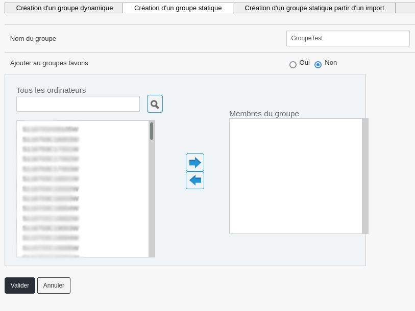
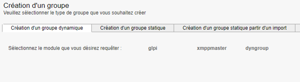
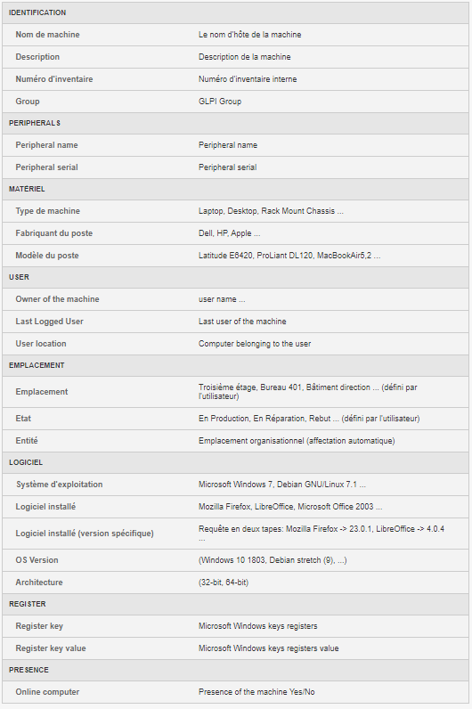
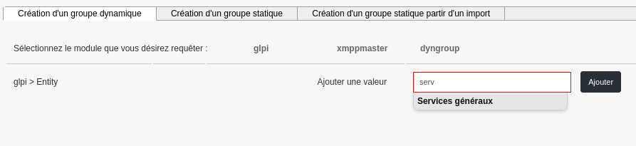

=======================
Groupe de machines
=======================

| Cette section concerne la partie Groupe de machines de l'outil Pulse.
|

| Les groupes de machines permettent de constituer un ensemble de machines. Il existe trois types de groupes :
| - Les groupes statiques ;
| - Les groupes dynamiques ;
| - Les groupes créés depuis un import.

Groupe statique
================

Dans le groupe statique, la sélection des machines membres de ce groupe est manuelle.

| Il est possible d’éditer un groupe statique pour ajouter ou supprimer d’autres machines.
| Il suffit d'utiliser les flèches pour ajouter ou supprimer les machines du groupe.

Groupe dynamique
=================

| Un groupe dynamique est un groupe basé sur une requête sur la base d'inventaire de machines en fonction de critère(s).
| Il est possible de combiner plusieurs critères avec des opérateurs booléens.
| Le résultat est stocké sous forme de requête (dynamique) ou de résultat (figé à l'instant T).

| Trois modules sont disponibles pour la création de groupe dynamique :
| -	Module GLPI : permet d'utiliser les critères d'inventaire des machines ;
| -	Module xmppmaster : permet d'utiliser l'Active Directory ou LDAP ;
| -	Module dyngroup : permet d'utiliser des groupes dynamiques existants.

| Sauf cas particulier, il faut toujours choisir « GLPI ». En effet, la requête peut être effectuée sur différents champs, voir ci-dessous :

Par exemple, utiliser le champ "Entité" se présente comme ceci : 

L'auto-complétion propose les valeurs existantes après avoir renseigné trois caractères.

Exemple concret de groupe dynamique
------------------------------------

| Pour notre exemple, nous allons créer un groupe de machine sur lesquels une version obsolète de Firefox est présente.
| Pour commencer, il faut ajouter un critère « Logiciel » avec la valeur « Mozilla Firefox * » pour tester la présence de Firefox (le caractère "*" peut être utilisé pour compléter le critère par n'importe quel caractère et donc trouver toutes les versions de Firefox);
| Ensuite, il faut cliquer sur « glpi » à nouveau pour ajouter un second critère ;
| Choisir « Version » puis renseigner « Mozilla Firefox * » puis « 47.0 » (ce critère sera inversé, plus d'informations juste après)
| *(Le critère « Version » seul retournerait les machines avec Firefox obsolète OU n'ayant pas Firefox du tout)*

.. image:: images/exemplegroupdyn.png

| Il faut s'inspirer de la liste d'auto-complétions pour adapter au mieux le critère de recherche :
| Par exemple, Firefox apparaît avec une entrée pour chaque version, d'où l'utilisation de « * ».

.. image:: images/firefox.png

| Une fois la requête terminée, il faut la sauvegarder. 
| Il est donc possible de sauvegarder en tant que « requête » (dynamique) ou en tant que « résultat » (requête à l'instant T).
| Si on ajoute le groupe aux groupes favoris, on peut retrouver le groupe dans le menu de gauche, onglet "Groupes favoris".

Opérateur booléen :
~~~~~~~~~~~~~~~~~~~~

| Les opérateurs disponibles sont  AND, OR, NOT ainsi que les ( ).
| AND : Permet d'associer les requêtes : AND(1,2)
| NOT : Permet d'inverser le résultat de la seconde requête : NOT(2) 
| OR : Permet d'utiliser l'une ou l'autre requête : OR(1,2)

| Pour notre requête, nous devons combiner les deux conditions AND et NOT : AND(1,NOT(2))

| Cela revient à demander les machines ayant le logiciel « Mozilla Firefox * » installé ET dont la version de
| « Mozilla Firefox * » N'EST PAS « 47.0 »
| Vous pouvez vérifier vos opérateurs en cliquant sur le bouton « Vérifier »
| Il est aussi possible de visualiser le contenu du groupe avant de valider en cliquant sur le bouton « Voir le contenu »

