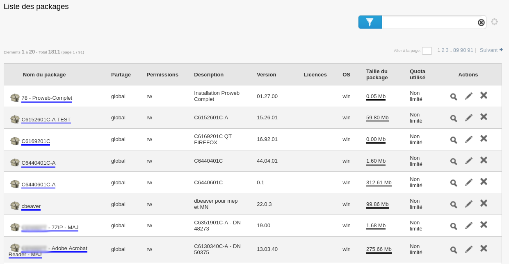
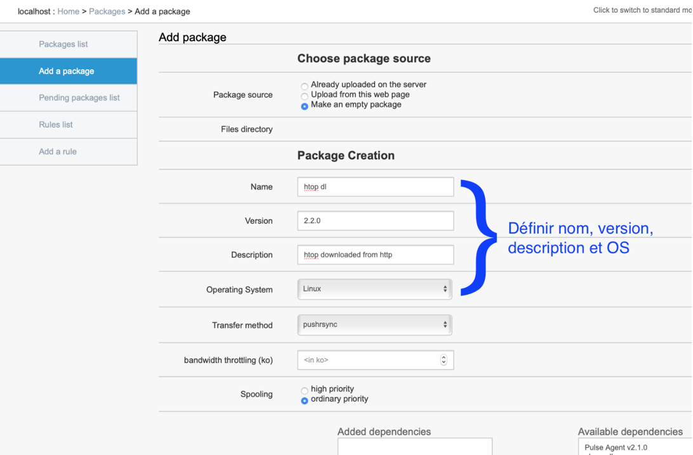
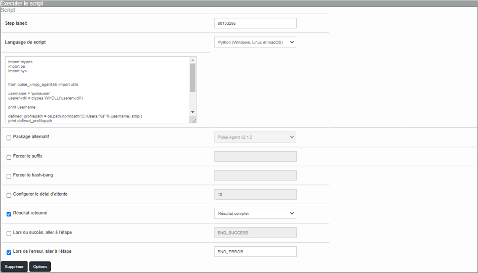
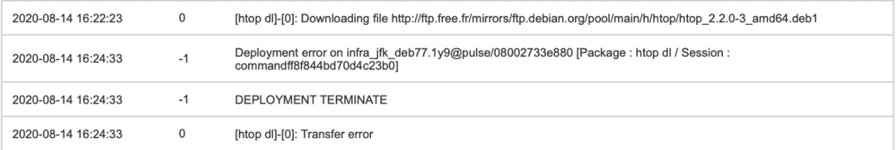
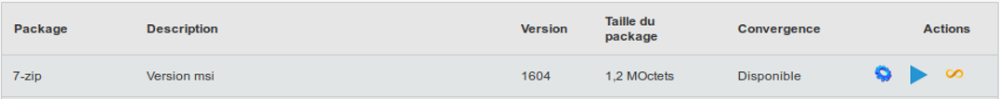
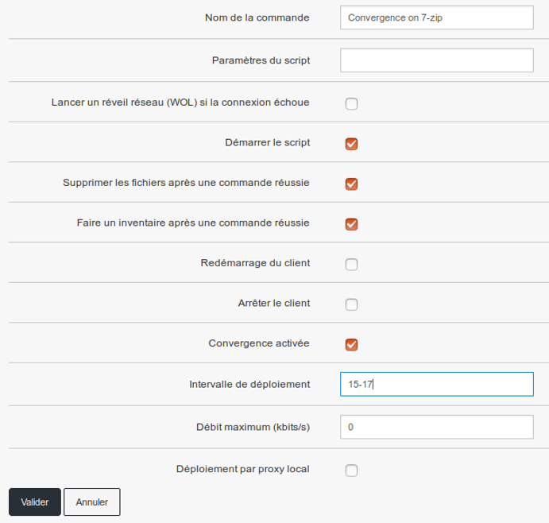

===========
Packages
===========

En cliquant sur le menu Packages, on arrive directement sur les packages accessibles par l’utilisateur en fonction de ses droits :

| Dans le menu de gauche, nous aurons divers sous-menus concernant les packages :

.. image:: images/sousmenu.png

Ajouter un package 
===================

| Depuis l’icône principale « package », l’interface de création et un wizard sont disponibles pour assister à la création de package.
| Pour créer un package, il faut que son installation soit silencieuse ou sans interaction utilisateur.
| Il faut privilégier les versions msi des applications, car elles sont développées pour être déployées en masse silencieusement.
| 
| Pour créer un package, il faut fournir les fichiers constituant le package soit via :
| -	Le partage Samba « package » ;
| -	L’interface MMC.

Le partage Samba "Package"
--------------------------

| Il permet de gérer plus simplement les fichiers de grandes tailles.
| Il faut impérativement créer un dossier contenant les fichiers.
| Si votre package contient un sous-dossier, il faut alors le zipper.

L'interface MMC
----------------

Via l’interface, il suffit de charger les fichiers nécessaires.

.. image:: images/sourcepaquet.png

Assistant à la création
------------------------

Exemple de création de package contenant PDFCreator

| On clique sur le menu "Ajouter un package"
| Puis il faut choisir "Envoyer depuis cette page"
| Sélectionner le fichier .msi ou .exe de PDFCreator puis
| Cliquer sur transmettre les fichiers

.. image:: images/pdfcreator.png

| Le fichier va alors être transmis à Pulse, qui va tenter de détecter automatiquement la commande d'installation.
|
| Il faut remplir les champs "Nom", "Version" et "Description" du package.
| 
| Dans la partie requête, on peut voir la commande générée automatiquement.
| La commande d'installation est en général du type "nom du fichier" -ms 
| On peut ajouter les paramètres d'installation silencieuse suivant pour InnoSetup : 
| /SP /VERYSILENT /NORESTART

.. image:: images/command.png

| Il ne reste plus qu'à cliquer sur "Valider" en bas de page.
| Le package est alors en attente d'intégration au système et de synchronisation avec les différents sites.
| Une fois le package synchronisé, il apparaît alors dans la liste des paquets disponibles.
|
| On peut tester le déploiement sur une machine de test.
|
| On constate, dans ce cas là, que PDFCreator a installé PDFArchitect et une Toolbar dans Internet Explorer.
|
| Il faut alors chercher sur Internet des solutions avec les mots clés types : « pdf creator silent installation toolbar »
| Le site « wpkg » donne des informations intéressantes :
| http://wpkg.org/PDFCreator
| Components=program,ghostscript,images2pdf,pdfarchitect...
| Tasks=desktopicon,desktopicon\common,winexplorer
| 
| Le site officiel donne, quant à lui, des paramètres supplémentaires.
| http://www.pdfforge.org/content/setup-command-line-parameters
| /COMPONENTS="comma separated list of component names"
| Overrides the default components settings.
| Sample: /COMPONENTS=”program,ghostscript,comsamples,helpfiles\english,languages\english”
|
| Il faut ensuite éditer le paquet pour ajouter les paramètres suivants :
| /COMPONENTS= "program,ghostscript,images2pdf,helpfiles,helpfiles\french,languages,languages\french" 
| /MERGETASKS="!desktopicon" /ForceInstall

Commande d'assistance
----------------------

| La plupart des installeurs offrent une aide, on peut la lancer depuis une console « CMD » :
| c:\ moninstaller.exe / ?

Création de package avancée
----------------------------

Depuis la vue Packages, créer un nouveau package en remplissant les champs pour un déploiement classique :

Plus loin sur cette même page, déplacer l'action **Download File** *(Télécharger le fichier)* vers le Workflow et définir l'URL contenant le fichier à télécharger

.. image:: images/downloadfile.png

| Lors du déploiement du package, le fichier sera téléchargé dans le dossier du package sur la machine cliente. Il est possible de le traiter avec l'action qui conviendra.
| Ici, nous avons pris le cas de l'action **Run Command** *(Executer la commande)*.
| Il faut donc déplacer l'action **Run command** vers le Workflow et inscrire la commande qui permettra de traiter le fichier téléchargé :

.. image:: images/runcommand.png

| Cliquer sur **Confirm** *(Valider)* pour créer le package.

Une autre fonction importante est présente : la fonction **Executer le script**, qui permet de lancer un script dans le langage que l'on souhaite

.. image:: images/script.png

| En cliquant sur le bouton "Options", nous pourrons alors avoir accès à un ensemble de paramètres permettant par exemple de choisir le suffixe du script ou le hashbang du script :

| Il existe aussi la fonction **Dézipper un fichier**, qui permet de dézipper un fichier contenant plusieurs fichiers.
| Pour cette fonction, il suffira de passer le nom du fichier et l’agent ira dézipper le fichier avant d’exécuter l’installation.
| De même, dans les options de cette fonction, nous pourrons par exemple lui passer un chemin de dossier dans lequel dézipper le fichier, ainsi que d’autres options.

.. image:: images/dezip.png

Déploiement du package
-----------------------

Lors du déploiement, le déroulement des étapes est affiché. Les lignes suivantes montrent qu'un téléchargement a lieu et qu'il est réussi :

.. image:: images/succes.png

En cas d'erreur, les lignes suivantes sont affichées :

Et dans la vue générale des déploiements, le statut est le suivant: **ABORT TRANSFER FAILED**

Déploiement programmé
======================

Ce type de déploiement permet de planifier quand le déploiement va avoir lieu mais également plusieurs options :

.. image:: images/program.png

| Les différents champs à renseigner sont les suivants : 
| - Le nom de la commande, 
| - La notion de plage de début et de fin, qui permet de figer une fenêtre de déploiement, 
| - L’intervalle de déploiement, qui permet de définir une plage horaire durant laquelle le déploiement doit être effectué,
| - La priorisation de déploiement, par exemple si plusieurs déploiements sont déjà en cours.

Déploiement sur groupe
=======================

Le déploiement sur groupe est identique au déploiement unitaire. Cependant, on va trouver en plus la convergence applicative, cf point suivant.

Convergence
============

| La convergence est un déploiement spécifique qui a comme particularité de ne pas avoir de fin.
| Elle va vérifier tous les jours que les postes sont conformes à ce qui a été défini, et va les rendre conforme si besoin.
| Au préalable, il faut que vos packages soient prêts à la convergence. Egalement, une convergence ne s’applique que sur des groupes.
| Pour rendre disponible la convergence à un package, il faut l’associer à son empreinte d’inventaire.
| 
| Exemple avec le package 7-ZIP :
| Le package a été créé et installé une première fois.
| On associe le package à son inventaire.

.. image:: images/7zip.png

| À partir de trois caractères la complétion propose une liste d’entrée d’inventaire correspondante.
| Sélectionner celle correspondante aux logiciels, et la convergence devient disponible lors d’un déploiement sur un groupe.

| Afin d'activer la convergence, il faut sélectionner l'icône "infini" orange.

| La convergence n’a pas de fin, sa programmation est définie par un intervalle de déploiement.
|
| Par exemple, si nous souhaitons un intervalle de 15 heures à 17 heures tous les jours, il faut procéder comme ceci : 

.. image:: images/intervalle.png 

